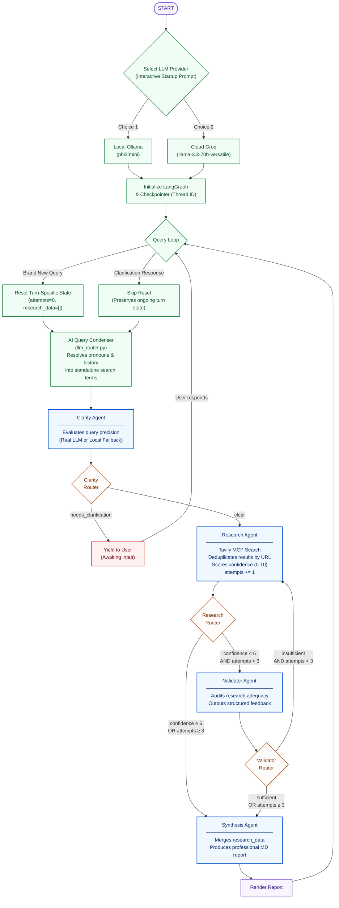

# ResearchFlow AI

ResearchFlow AI is an advanced, production-grade LangGraph multi-agent pipeline designed for deep, autonomous business research and intelligence gathering. By coordinating four specialized agentic personas—Clarity, Research, Validator, and Synthesis—through a Directed Acyclic Graph (DAG) state machine, the system transforms vague, multi-turn conversational queries into professional, highly validated executive reports.

---

## Key Highlights and Features

- **Interactive LLM Provider Switching (Ollama vs. Groq vs. Gemini):** Toggle dynamically at startup between running a 100% offline local model (Ollama with `phi3:mini`) and lightning-fast cloud flagship APIs (Groq with `llama-3.3-70b-versatile`). No manual `.env` file editing needed.
- **AI-Driven Multi-Turn Query Condensation:** Seamlessly supports continuous conversation. Pronouns (such as *"their"*, *"it"*, or *"him"*) and follow-up context are dynamically resolved into independent, standalone research queries using history transcript analysis.
- **State Reset Leakage Protection:** Query-specific states (`attempts`, `research_data`, and validation feedback) are dynamically wiped clean on brand-new turns, preventing old report data from bleeding into new searches while maintaining conversation memory intact.
- **Iterative Human-in-the-Loop Clarification:** Ambiguous queries are identified at the boundary and returned to the user for clarification before web-search credits are consumed.
- **Self-Correcting Validator and Retry Loops:** The Validator agent audits gathered search data against the user's research request. If gaps are identified, it generates structured feedback and loops back to the Research agent for targeted search expansion (up to 3 rounds).
- **Offline Graceful Fallbacks:** Fully operational without API credentials. Every node automatically degrades to robust, deterministic mock logics if API keys are absent or configured as placeholders.

---

## Architecture and Orchestration Flow



---

## Specialized Agentic Personas

| Agent | Core Model | Key Responsibilities |
| :--- | :--- | :--- |
| **Clarity Agent** | Dynamic Model Selection | Inspects query specificity; triggers a human-in-the-loop clarification loop if missing a clear topic or subject. |
| **Research Agent** | Dynamic Model Selection | Optimizes queries for search engines, interacts with Tavily MCP, deduplicates search payloads, and self-scores result confidence. |
| **Validator Agent** | Dynamic Model Selection | Acts as a quality controller, cross-checking search payloads with the initial query to find knowledge gaps. |
| **Synthesis Agent**| Dynamic Model Selection | Combines compiled research results, processes tabular formatting, and outputs a publication-grade markdown report. |

---

## Managed State Fields

| Field Name | Type | Writer Node | Description |
| :--- | :--- | :--- | :--- |
| `messages` | `List[BaseMessage]` | *All* (Append-only) | Stores full user queries, agent outputs, and system transitions. |
| `clarity_status` | `"clear" \| "needs_clarification"` | `clarity_agent` | Decides if we can run search or must prompt for clarity. |
| `confidence_score` | `int` (0–10) | `research_agent` | Scored confidence of the gathered research data. |
| `validation_result`| `"sufficient" \| "insufficient"`| `validator_agent` | Determines if we need loopback search retries. |
| `research_data` | `List[Dict]` | `research_agent` | Accumulated payload of results (deduplicated by URL). |
| `attempts` | `int` | `research_agent` | Turn-specific loop count (circuit breaker triggers at 3). |
| `validator_feedback`| `Optional[str]` | `validator_agent` | Explicit gap feedback to redirect the subsequent search. |
| `degraded_mode` | `Optional[str]` | *Any* | Tracks API failures to trigger graceful offline behaviors. |

---

## Installation and Setup

### 1. Clone the Project
```bash
git clone <your-repository-url>
cd ResearchFlow_AI
```

### 2. Configure Your Virtual Environment
```bash
# Create Python 3.10+ Virtual Environment
python3 -m venv .venv

# Activate the Environment
source .venv/bin/activate  # Windows: .venv\Scripts\activate

# Install Dependencies
pip install -r requirements.txt
```

### 3. Setting Up Your Local Model (Optional)
If you would like to run 100% locally on your computer:
1. Download and install [Ollama](https://ollama.com/).
2. Pull the lightweight and powerful Phi-3 Mini model:
   ```bash
   ollama pull phi3:mini
   ```
3. Keep the Ollama background service running.

### 4. Create Your `.env` File
Create a `.env` file in your root directory to configure credentials:
```ini
# LangGraph Multi-Agent Research Assistant Configuration
LLM_PROVIDER=ollama
OLLAMA_MODEL=phi3:mini

# Cloud Provider API Key (Extremely Fast & Flagship Model Execution)
GROQ_API_KEY=gsk_your_groq_key_here

# Tavily Web Search API Key (Used for live web crawling)
TAVILY_API_KEY=tvly-your_tavily_key_here
```
*Note: Any key left as a blank placeholder or set as `"placeholder"` automatically triggers graceful mock fallbacks so you can play with the graph fully offline!*

---

## Running the Application

Launch the research pipeline directly:
```bash
python main.py
```

### Prompt Interactive Selection
Upon launch, you will be greeted by the terminal menu to select your mode:
```text
🤖 Choose your LLM Execution Mode for this session:
   [1] Local (Ollama - phi3:mini) 🏠
   [2] Cloud API (Groq - llama-3.3-70b-versatile) ⚡

👉 Enter choice (1 or 2) [default: 1]:
```

Simply input your choice or hit **Enter** to default to the local model, and begin researching! Type `exit` or `quit` to exit.

---

## Running Tests

Ensure system performance and integration safety by running the test suite:
```bash
# Run all 65 automated tests offline (zero api credits consumed)
pytest tests/ -v
```

---

## Architectural Design Decisions (ADRs)

Key engineering patterns and architectural choices are recorded in `.claude/commons/decisions/`:

*   **ADR-000:** Native use of `Literal` types for routing states.
*   **ADR-001:** Validator agent inherits explicit `HumanMessage` in its `invoke` chain.
*   **ADR-002:** Clarity fallback relies on proper-noun tokenization checks rather than static keyword patterns.
*   **ADR-003:** Full URL-based payload deduplication in the `research_data` collection on loopbacks.
*   **ADR-004:** Synthesis fallback dynamically synthesizes reports from `research_data` when offline.
*   **ADR-005:** Thread isolation generated as a unique `uuid4()` session to eliminate state bleed.
*   **ADR-006:** Context payloads are injected as `HumanMessage` instead of `SystemMessage` in the synthesis prompt to optimize modern chat alignments.
