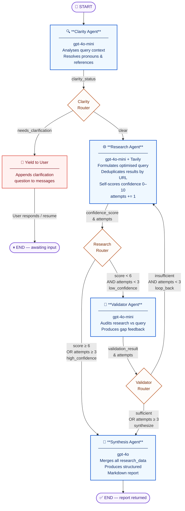

# ResearchFlow AI

A LangGraph multi-agent pipeline for AI-powered business research. Four specialized agents — Clarity, Research, Validator, and Synthesis — coordinate through a directed state machine to produce structured research reports from natural-language queries.

---

## Features

- **Clarification loop** — ambiguous queries are caught before any web search begins
- **Iterative research** — the Validator agent reviews results and sends targeted feedback to the Research agent for up to 3 retry rounds
- **Circuit-breaker** — the pipeline always terminates; after 3 research attempts the Synthesis agent runs regardless of confidence
- **Offline mode** — all agents fall back to deterministic mock logic when API keys are absent, so the full graph runs without any credentials
- **Prompt injection boundaries** — user-controlled input and Tavily results are delimited with XML tags in every prompt
- **Thread isolation** — each CLI session generates a `uuid4()` thread ID so state never bleeds across restarts

---

## Architecture



### Agents

| Agent | Model | Responsibility |
|---|---|---|
| `clarity_agent` | gpt-4o-mini | Detects ambiguous queries; routes to clarification or research |
| `research_agent` | gpt-4o-mini | Web search via Tavily; scores result confidence (0–10) |
| `validator_agent` | gpt-4o-mini | Audits research sufficiency; produces targeted gap feedback |
| `synthesis_agent` | gpt-4o | Assembles the final report from accumulated `research_data` |

### State fields

| Field | Type | Writer |
|---|---|---|
| `messages` | `List[BaseMessage]` (append-only) | clarity, synthesis |
| `clarity_status` | `"clear" \| "needs_clarification"` | clarity_agent |
| `confidence_score` | `int` 0–10 | research_agent |
| `validation_result` | `"sufficient" \| "insufficient"` | validator_agent |
| `research_data` | `List[Dict]` | research_agent (URL-deduplicated) |
| `attempts` | `int` | research_agent |
| `validator_feedback` | `Optional[str]` | validator_agent |

---

## Prerequisites

- Python 3.10+
- `pip` (for creating the virtual environment)

---

## Installation

```bash
# 1. Clone the repo
git clone <repo-url>
cd ResearchFlow_AI

# 2. Create and activate a virtual environment
python -m venv .venv
source .venv/bin/activate   # Windows: .venv\Scripts\activate

# 3. Install dependencies
.venv/bin/pip install -r requirements.txt
```

---

## Environment Variables

Create a `.env` file in the project root:

```
OPENAI_API_KEY=sk-...       # Used by all agents (gpt-4o-mini; synthesis uses gpt-4o)
TAVILY_API_KEY=tvly-...     # Used by the Research agent for live web search
```

Both keys are optional. Any value containing `"your_"` or equal to `"placeholder"` is treated as absent and triggers the offline mock fallback. The full pipeline works without any credentials.

---

## Running the App

```bash
.venv/bin/python main.py
```

The CLI will display live node-by-node progress and print the final research report. Type `exit` or `quit` to end the session.

---

## Running Tests

```bash
# Full suite (63 tests)
.venv/bin/python -m pytest tests/ -v

# Single test
.venv/bin/python -m pytest tests/test_graph.py::test_ambiguous_query_halts_for_clarification -v
```

All tests run fully offline — no API keys required.

---

## Project Structure

```
ResearchFlow_AI/
├── main.py                      # CLI entry point
├── requirements.txt
├── app/
│   ├── agents/
│   │   ├── clarity_agent.py
│   │   ├── research_agent.py
│   │   ├── validator_agent.py
│   │   └── synthesis_agent.py
│   ├── graph/
│   │   ├── builder.py           # StateGraph construction and compilation
│   │   └── routing.py           # Conditional edge functions
│   ├── memory/
│   │   └── checkpoint.py        # LangGraph MemorySaver setup
│   ├── prompts/
│   │   ├── clarity_prompt.py
│   │   ├── research_prompt.py
│   │   ├── validator_prompt.py
│   │   └── synthesis_prompt.py
│   ├── schemas/
│   │   └── state.py             # ResearchAssistantState TypedDict
│   └── tools/
│       └── tavily_search.py     # Tavily web search wrapper
└── tests/
    ├── conftest.py
    └── test_graph.py            # 63 tests: unit, integration, edge cases
```

---

## Design Decisions

Key architectural choices are documented as ADRs in [`.claude/commons/decisions/`](.claude/commons/decisions/):

| ADR | Decision |
|---|---|
| ADR-000 | `Literal` types for routing state fields |
| ADR-001 | Validator agent requires `HumanMessage` in `invoke` call |
| ADR-002 | Clarity fallback uses proper-noun heuristic, not keyword list |
| ADR-003 | `research_data` deduplicated by URL on every retry |
| ADR-004 | Synthesis fallback derives content from `research_data` |
| ADR-005 | Thread ID generated as `uuid4()` per session |
| ADR-006 | Research data passed as `HumanMessage`, not `SystemMessage`, in synthesis prompt |
